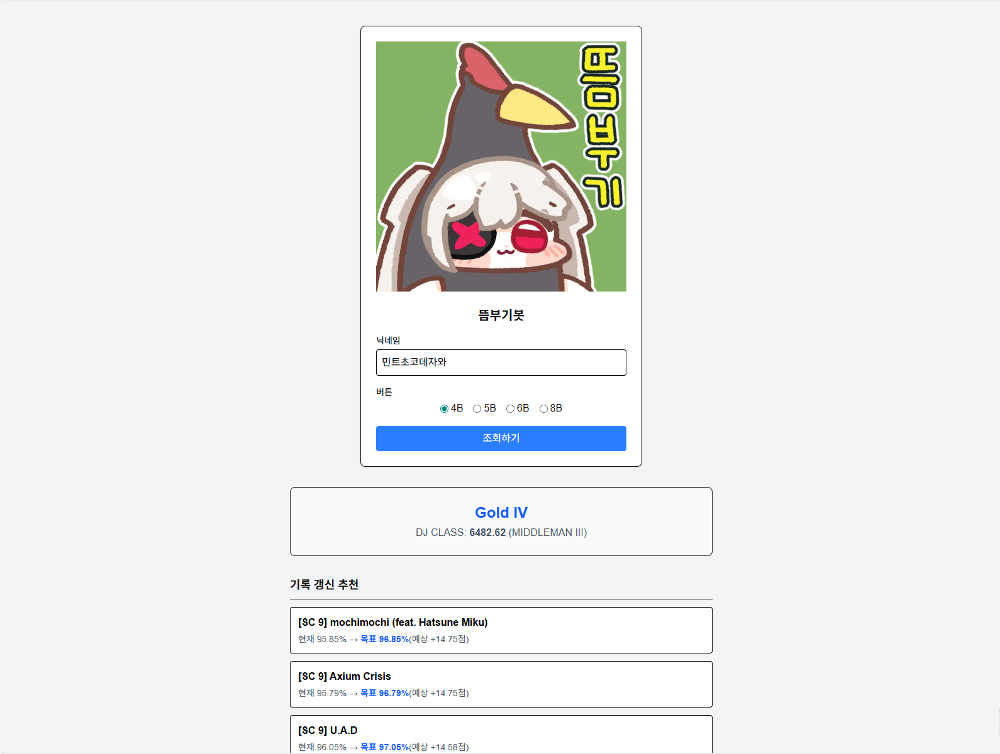
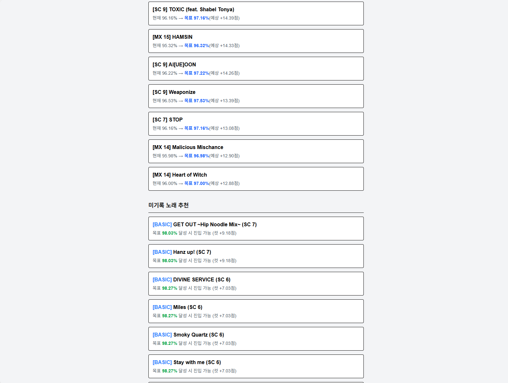

# 뜸부기봇

DJMAX Song Recommender의 웹 클라이언트입니다.
V-ARCHIVE 닉네임을 입력하면 성과표를 시각화하고, **DJ CLASS 상승을 위한 전략적인 곡 추천**을 제공합니다.

> **🌐 서비스 바로가기:** [뜸부기봇](https://tteumbugi-bot.vercel.app)

## ✨ 주요 기능
- **간편한 조회:** 닉네임과 버튼(4B/5B/6B/8B) 선택만으로 즉시 분석
- **성과 분석:** 현재 V-Archive 티어와 정밀 계산된 DJ CLASS 점수 표시
- **추천 리스트 시각화:**
  - **기록 갱신 추천:** 목표 정확도와 예상 상승 점수를 직관적으로 표시
  - **미기록 노래 추천:** 내 실력에 맞는 난도의 곡 발굴 및 진입 컷 안내

## 🛠️ 기술 스택 (Tech Stack)
- **Framework:** Next.js 14 (App Router)
- **Language:** TypeScript
- **Styling:** Tailwind CSS
- **Deploy:** Vercel

## 📸 실행 화면
  


## 🚀 실행 방법
```bash
# 1. 의존성 설치
npm install

# 2. 개발 서버 실행
npm run dev